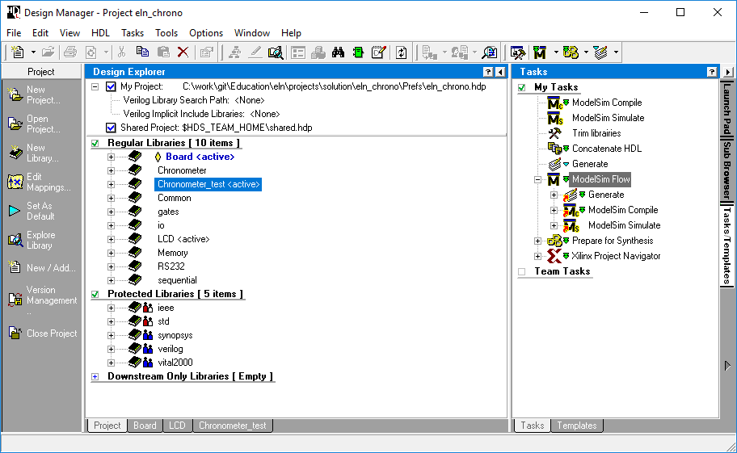

<h1 align="center">
   
  
   
  RC Kart Summerschool Project
   
</h1>

<h4 align="center">Labor Files for RC Kart Summerschool Project. 
See also the <a href="https://ss1.hevs.io/" target="_blank">Summer School 1 Website</a>.</h4>

# Table of contents

  <a href="#command-interpreter">Command interpreter</a> •
  <a href="#releases">Releases</a> •
  <a href="#credits">Credits</a> •
  <a href="#license">License</a> •
  <a href="#find-us-on">Find us on</a>

## Command interpreter
[(Back to top)](#table-of-contents)
The **Command interpreter** executables and scripts available under the folder of the same name is a little tool to connect to the FPGA through UART and emulate commands sent by the smartphone, allowing to test the electronic without waiting on the app.

> Remove the BLE module if using the UART connection, else scrambled and unreadable data may be sent and received due to collisions

One can use the `justfile` present in the `src` folder to build the executable by running `just build` or test the app with `just run`.

When building, first change the `BUILD_VERSION` in the `justfile`.

Windows and MAC builds must be run on dedicated platforms and pushed as commits.

The CI handles building for Linux.

See the [SS1 website](https://ss1.hevs.io/hw/testing.html#communication-emulation) for documentation.

## Releases
[(Back to top)](#table-of-contents)
If a commit is pushed along with a new tag on the `master`, it wil automatically create releases for:
- The **Kart command interpreter** used to simulate the smartphone's behavior
- The **PDB** programming files for FlashPro (Libero's programmer)
- The **SVF** programming files for OpenOCD (onboard FT2232H programmer)

Those releases can be found [here](https://gitlab.hevs.ch/ss1/kart-vhdl/-/releases).

## Credits
[(Back to top)](#table-of-contents)
* COF
* PRC
* ZAS
* AMA

## License
[(Back to top)](#table-of-contents)

:copyright: [All rights reserved](LICENSE)

---

## Find us on
> [hevs.ch](https://www.hevs.ch) &nbsp;&middot;&nbsp;
> Facebook [@hessovalais](https://www.facebook.com/hessovalais) &nbsp;&middot;&nbsp;
> Twitter [@hessovalais](https://twitter.com/hessovalais) &nbsp;&middot;&nbsp;
> LinkedIn [HES-SO Valais-Wallis](https://www.linkedin.com/groups/104343/) &nbsp;&middot;&nbsp;
> Google+ [HES-SO Valais Wallis](https://plus.google.com/105282401140539059594) &nbsp;&middot;&nbsp;
> Youtube [HES-SO Valais-Wallis](https://www.youtube.com/user/HESSOVS)
