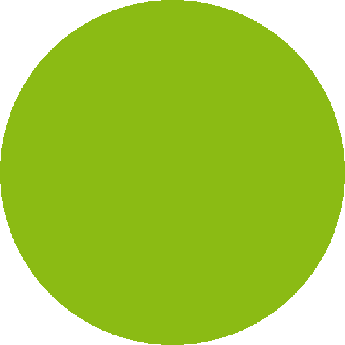
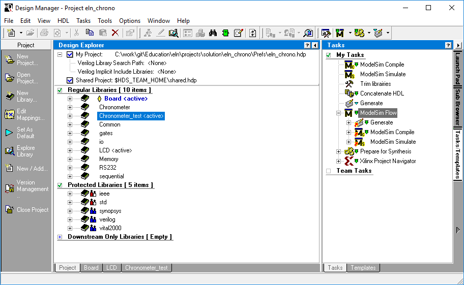

<h1 align="center">
   
  
   
  DiD Kart Summerschool Project - Adapted for the new [EBS3 Igloo board](https://gitlab.hevs.ch/infrastructure/labos/digital-electronics/boards/ebs3)
   
</h1>

<h4 align="center">Labor Files for DiD Kart Summerschool Project.
See also: <a href="https://cyberlearn.hes-so.ch/" target="_blank">Moodle Cyberlearn</a>.</h4>

# Table of contents

  <a href="#credits">Credits</a> •
  <a href="#license">License</a> •
  <a href="#find-us-on">Find us on</a>

## Credits
[(Back to top)](#table-of-contents)
* COF
* PRC
* ZAS
* AMA

## License
[(Back to top)](#table-of-contents)

:copyright: [All rights reserved](LICENSE)

---

## Find us on
> [hevs.ch](https://www.hevs.ch) &nbsp;&middot;&nbsp;
> Facebook [@hessovalais](https://www.facebook.com/hessovalais) &nbsp;&middot;&nbsp;
> Twitter [@hessovalais](https://twitter.com/hessovalais) &nbsp;&middot;&nbsp;
> LinkedIn [HES-SO Valais-Wallis](https://www.linkedin.com/groups/104343/) &nbsp;&middot;&nbsp;
> Google+ [HES-SO Valais Wallis](https://plus.google.com/105282401140539059594) &nbsp;&middot;&nbsp;
> Youtube [HES-SO Valais-Wallis](https://www.youtube.com/user/HESSOVS)
